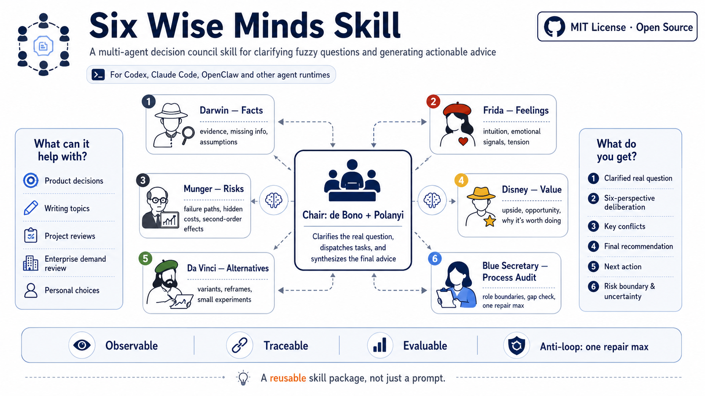

# Six Wise Minds Skill



> A traceable, observable, and evaluable multi-perspective deliberation protocol for fuzzy decisions.

[](LICENSE)


**Six Wise Minds Skill** is an open-source Agent Skill package for fuzzy, conflicted, or high-uncertainty decisions. It is not a standalone app and not a celebrity role-play prompt. It turns six thinking modes into a structured advisory protocol that an agent can execute.

The core workflow:

- the Chair reveals the real decision question behind the surface question;
- six thinking roles deliberate from facts, emotions, risks, value, alternatives, and process quality;
- the Blue Secretary audits role boundaries and decides whether one local repair pass is needed;
- the Chair synthesizes a bounded advisory judgment with evidence, uncertainty, safety boundaries, and next actions.

Primary language: [中文](README.md)

## Contents

- [What it is for](#what-it-is-for)
- [Example](#example)
- [Installation](#installation)
- [Usage](#usage)
- [The Six Wise Minds](#the-six-wise-minds)
- [How it works](#how-it-works)
- [Observability, traceability, evaluation](#observability-traceability-evaluation)
- [Safety boundaries](#safety-boundaries)
- [Repository structure](#repository-structure)
- [Current status](#current-status)
- [License](#license)

## What it is for

Use it for:

- product, project, or open-source direction decisions;
- writing topics and content strategy;
- enterprise demand review, RPA pilots, AI Agent proposals, and workflow automation ideas;
- career, collaboration, or long-term direction clarification;
- lightweight daily decisions that benefit from quick multi-perspective thinking.

Do not use it for:

- simple factual lookup;
- translation, polishing, or rewriting only;
- direct coding or file operations;
- final medical, legal, financial, or psychological crisis advice;
- cases where the user explicitly wants a single direct answer without deliberation.

## Example

```text
User   ❯ Use Six Wise Minds Skill to decide:
         Is this multi-agent six-hat decision advisor Skill worth building?

Chair  ❯ The real question is not "can it be built?"
         It is whether the Skill has enough differentiated value,
         stable boundaries, and maintainable protocol structure
         to justify an open-source Skill package instead of becoming an oversized app.

White  ❯ Known: the project includes SKILL.md, role cards, schemas, eval assets,
         output templates, and platform adapter notes.
         Missing: longitudinal user data and real platform validation for adapter auto-loading.

Black  ❯ Main failure path: it may degrade into long-form role-play,
         or prematurely expand into UI, installers, and scripts.

Green  ❯ The smallest viable path is a bounded V1.0 Skill package,
         validated against examples and high-risk gates.

Blue   ❯ Role boundaries are acceptable. No repair pass is required.

Chair  ❯ Advisory judgment: it is worth building, but as a bounded V1.0 Skill protocol package,
         not as a standalone app.
```

The named figures are cognitive anchors only. The Skill must not imitate their voice, biography, or historical style.

## Installation

This version is a document-based Skill protocol package. It does not require a UI, automation scripts, or long-term memory.

### Codex

Clone the repository into your Codex skills directory, or place it under a repository-level skills folder:

```bash
git clone https://github.com/nightboy87/Six-Wise-Minds-Skill ~/.codex/skills/six-wise-minds
```

Codex adapter templates are available in:

```text
platform/codex/agents/
```

These files are adapter templates. Verify that your active Codex environment supports the same custom-agent TOML schema before treating them as automatically loadable.

### Claude Code

```bash
git clone https://github.com/nightboy87/Six-Wise-Minds-Skill ~/.claude/skills/six-wise-minds
```

Claude Code adapter templates are available in:

```text
platform/claude-code/agents/
```

Verify that your active Claude Code environment supports the same subagent frontmatter before treating them as automatically loadable.

### OpenClaw or generic agents

If your runtime does not support automatic Skill loading, use this repository as a reference package, or ask the agent to read:

```text
SKILL.md
references/
assets/council-report-template.md
```

When true subagent isolation is unavailable, use `simulated_isolated_turns` and disclose that mode in the final output.

## Usage

After installation, ask:

```text
Use Six Wise Minds Skill to help me decide: is this AI tool worth building?
```

```text
Use Six Wise Minds Skill for deep deliberation: should this RPA request enter a pilot?
```

```text
Use Six Wise Minds Skill for a quick decision: should I eat out tonight or cook at home?
```

The Skill chooses among:

- `quick`: low-risk daily decisions, lightweight simulated mode;
- `standard`: default full six-perspective deliberation;
- `deep`: complex product, enterprise, organizational, or high-impact project decisions.

## The Six Wise Minds

| Role | Cognitive anchor | Function | Must not do |
|---|---|---|---|
| Chair | Edward de Bono + Michael Polanyi | Reveal the real question, organize deliberation, synthesize advisory judgment | Skip risk boundaries or decide for the user |
| White Hat | Charles Darwin | Facts, evidence, missing information, assumptions | Recommend or judge value |
| Red Hat | Frida Kahlo | Feelings, intuition, resistance, attraction, discomfort | Diagnose the user or use clinical labels |
| Black Hat | Charlie Munger | Risks, failure paths, invalid assumptions, second-order effects | Make the final veto |
| Yellow Hat | Walt Disney | Value, opportunity, upside, success conditions | Produce motivational slogans or ignore constraints |
| Green Hat | Leonardo da Vinci | Alternatives, reframes, variants, minimum experiments | Expand endlessly or choose the final answer |
| Blue Secretary | Peter Drucker-style process auditor | Process quality, role boundaries, repair decision | Replace the Chair |

## How it works

A standard run follows this sequence:

1. The user submits a fuzzy decision topic.
2. The Chair performs intake without answering immediately.
3. The Chair reframes the surface question into a council question.
4. The Skill applies the L0-L4 risk gate.
5. The run mode is selected: quick, standard, or deep.
6. The six thinking roles deliberate within their boundaries.
7. The Blue Secretary audits role discipline and process quality.
8. If a severe gap exists, at most one local repair pass is allowed.
9. The Chair produces the final advisory report.
10. The output includes trace summary, claim references, uncertainty, safety boundaries, and next actions.

### One-repair rule

Each user-requested deliberation allows:

- one main deliberation;
- at most one local repair pass;
- final synthesis after repair;
- no automatic third round.

This rule prevents the Skill from turning deliberation into decision delay.

## Observability, traceability, evaluation

This Skill is designed to make the process inspectable rather than merely persuasive.

### Observability

Final reports should include a trace summary:

```json
{
  "run_mode": "quick|standard|deep",
  "agent_mode": "true_multi_agent|simulated_isolated_turns",
  "repair_triggered": false,
  "repair_count": 0,
  "risk_level": "L0|L1|L2|L3|L4",
  "boundary_violations": [],
  "trace_complete": true
}
```

### Traceability

Important recommendations should cite role claims:

```text
Recommendation: Start with a document-protocol V1.0 package, not a standalone app.
Based on: [black:R1], [green:A1], [blue:Q1]
```

### Evaluation

Evaluation assets are included:

- `evals/trigger-cases.jsonl`
- `evals/non-trigger-cases.jsonl`
- `evals/role-boundary-cases.jsonl`
- `evals/high-risk-cases.jsonl`
- `evals/regression-cases.jsonl`
- `evals/output-quality-rubric.md`

V1.0 does not include a standalone evaluation runner. These assets are intended for manual or agent-assisted evaluation.

## Safety boundaries

Risk levels:

| Level | Meaning | Behavior |
|---|---|---|
| L0 | Low-risk daily decision | Quick or standard advice |
| L1 | Normal decision | Standard deliberation |
| L2 | High personal, project, or organizational impact | Strong uncertainty and small next step |
| L3 | Professional high-risk domain | Clarify only; recommend qualified professional input |
| L4 | Unsafe or disallowed | Refuse unsafe content; redirect to safe support |

This Skill does not replace medical, legal, financial, psychological crisis, or physical safety professionals. For L3 / L4 cases, it may clarify the question, list missing information, recommend professional support, or redirect to immediate safety steps.

## Repository structure

```text
six-wise-minds-skill/
├── SKILL.md
├── README.md
├── README.en.md
├── LICENSE
├── CHANGELOG.md
├── manifest.json
├── agents/
│   └── openai.yaml
├── .codex-plugin/
│   └── plugin.json
├── assets/
│   ├── council-report-template.md
│   ├── quick-mode-template.md
│   ├── deep-mode-template.md
│   ├── trace-summary-template.md
│   ├── readme-hero-zh.png
│   └── readme-hero-en.png
├── references/
│   ├── 00-principles.md
│   ├── 01-chair.md
│   ├── 02-repair-policy.md
│   ├── 03-safety-boundaries.md
│   ├── 04-observability-traceability-evaluation.md
│   ├── 05-output-contract.md
│   ├── 06-platform-adapters.md
│   ├── gotchas.md
│   └── roles/
├── schemas/
├── evals/
├── examples/
├── skills/
│   └── six-wise-minds/
└── platform/
```

## Current status

V1.0.0 includes:

- standard Skill entrypoint `SKILL.md`;
- Chair and six role cards;
- one-repair anti-loop policy;
- L0-L4 safety gate;
- output templates;
- JSON schemas;
- trigger, non-trigger, role-boundary, high-risk, and regression eval assets;
- adapter notes for Codex, Claude Code, OpenClaw, and generic agents.

Verified:

- `quick_validate.py` passes;
- JSON / JSONL / TOML / YAML parsing passes;
- all six role-card JSON examples match `schemas/hat-output.schema.json`;
- one product-decision case and one L4 psychological-crisis gate case were manually tested.

Not included:

- standalone UI;
- automation scripts;
- complex installer;
- long-term memory;
- verified cross-platform automatic subagent loading.

## License

MIT License. See [LICENSE](LICENSE).
