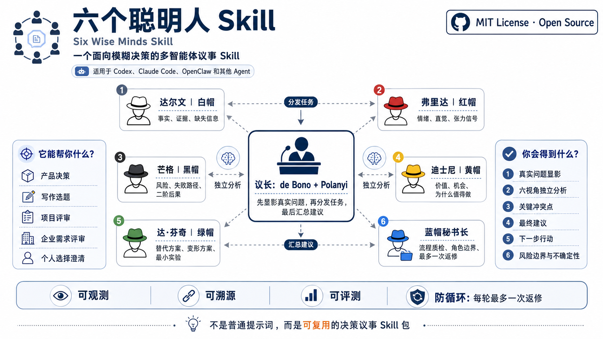

# 六个聪明人 Skill



> 把模糊、纠结、风险不明的决定，交给一套可观测、可溯源、可评测的多视角议事协议。

[](LICENSE)


**Six Wise Minds Skill** 是一个面向模糊决策的开源 Skill 协议包。它不是独立应用，也不是“六个名人聊天”，而是把六顶思考帽改造成一个可被 Agent 执行的决策顾问流程：

- 议长先显影用户真正想判断的问题；
- 六个思考角色分别从事实、情绪、风险、价值、创意、流程六个角度审议；
- 蓝帽秘书长检查流程质量、角色边界和是否需要一次局部返修；
- 议长最终汇总为有依据、有边界、能行动的顾问式建议。

其他语言： [English](README.en.md)

## 目录

- [适合什么问题](#适合什么问题)
- [效果示例](#效果示例)
- [如何安装](#如何安装)
- [如何使用](#如何使用)
- [六个聪明人是谁](#六个聪明人是谁)
- [工作原理](#工作原理)
- [可观测、可溯源、可评测](#可观测可溯源可评测)
- [安全边界](#安全边界)
- [仓库结构](#仓库结构)
- [当前状态](#当前状态)
- [许可证](#许可证)

## 适合什么问题

适合：

- 产品、项目、开源方向是否值得投入；
- 公众号、文章、内容选题是否成立；
- 企业需求、RPA、AI Agent、流程自动化方案是否值得试点；
- 职业、合作、长期方向选择前的澄清；
- 日常轻决策的快速多视角判断。

不适合：

- 单纯事实查询；
- 翻译、润色、改写；
- 直接编码或文件操作；
- 医疗、法律、财务、心理危机等高风险问题的最终专业建议；
- 用户明确只想要一个直接答案、不需要审议的场景。

## 效果示例

```text
用户  ❯ 用六个聪明人 Skill 帮我判断：
        这个多智能体六帽决策顾问 Skill 值不值得做？

议长  ❯ 表层问题不是“能不能做”，而是：
        它是否有足够清晰的差异化价值、稳定边界和可维护协议，
        值得作为开源 Skill 包发布，而不是演变成一个过重的 App？

白帽  ❯ 已知：项目已有 SKILL.md、角色卡、schemas、evals、输出模板和平台适配说明。
        缺失：真实用户连续使用数据，以及不同平台 agent adapter 的自动加载验证。

黑帽  ❯ 主要失败路径是变成长篇角色扮演，或者过早做 UI / 安装器 / 自动化脚本，
        让项目偏离协议包本质。

绿帽  ❯ 最小可行路径是发布 bounded V1.0 Skill 包，
        用 5 个 examples 手工评测，而不是先做独立应用。

蓝帽  ❯ 当前角色边界清楚，不需要返修。可以进入议长汇总。

议长  ❯ 顾问式判断：值得做，但应以“边界清楚的 V1.0 Skill 协议包”推进。
        下一步是验证 examples、风险门禁和 adapter templates。
```

这不是名人角色扮演。项目中的人物只作为稳定的认知锚点，帮助 Agent 保持不同思考模式的边界。

## 如何安装

当前版本是一个文档型 Skill 协议包，不需要 UI、脚本或长期记忆系统。

### Codex

将仓库 clone 到你的 Codex skills 目录，或放到仓库级 skills 目录：

```bash
git clone https://github.com/nightboy87/Six-Wise-Minds-Skill ~/.codex/skills/six-wise-minds
```

仓库内也提供 Codex adapter 模板：

```text
platform/codex/agents/
```

这些文件是 adapter templates。请先确认你的 Codex 环境支持对应 custom-agent TOML schema，再把它们当作自动加载配置使用。

### Claude Code

```bash
git clone https://github.com/nightboy87/Six-Wise-Minds-Skill ~/.claude/skills/six-wise-minds
```

Claude Code adapter 模板位于：

```text
platform/claude-code/agents/
```

同样需要先确认当前 Claude Code 环境支持对应 subagent frontmatter。

### OpenClaw 或通用 Agent

如果你的运行环境不支持 Skill 自动加载，可以把整个仓库作为 reference package 使用，或者直接让 Agent 读取：

```text
SKILL.md
references/
assets/council-report-template.md
```

当平台不支持真正的子智能体隔离时，应使用 `simulated_isolated_turns`，并在最终输出中明确标注。

## 如何使用

安装后，可以直接这样问：

```text
用六个聪明人 Skill 帮我判断：这个 AI 工具值不值得做？
```

```text
用六个聪明人 Skill 深度审议：这个业务部门提出的 RPA 需求是否值得进入试点？
```

```text
用六个聪明人 Skill 快速判断：我今晚是出去吃还是在家做饭？
```

Skill 会根据风险和复杂度选择：

- `quick`：低风险日常选择，轻量模拟；
- `standard`：默认模式，完整六视角审议；
- `deep`：复杂产品、企业、组织或高影响项目决策。

## 六个聪明人是谁

| 角色 | 认知锚点 | 负责什么 | 不能做什么 |
|---|---|---|---|
| 议长 | Edward de Bono + Michael Polanyi | 真问题显影、议程组织、最终顾问建议 | 不跳过风险边界，不替用户做最终决定 |
| 白帽 | Charles Darwin | 事实、证据、缺失信息、假设 | 不给建议，不判断价值 |
| 红帽 | Frida Kahlo | 情绪、直觉、抗拒、兴奋、不适感 | 不诊断用户，不使用临床标签 |
| 黑帽 | Charlie Munger | 风险、失败路径、反证、二阶后果 | 不做最终否决 |
| 黄帽 | Walt Disney | 价值、机会、成立条件 | 不输出鸡汤，不忽略约束 |
| 绿帽 | Leonardo da Vinci | 替代方案、变形方案、最小实验 | 不无限发散，不做最终选择 |
| 蓝帽秘书长 | Peter Drucker-style process auditor | 流程质检、角色边界、返修判断 | 不替代议长做最终建议 |

## 工作原理

一次标准审议按这个顺序运行：

1. 用户输入一个模糊议题；
2. 议长进行 intake，不直接回答；
3. 议长把表层问题改写成真正的 council question；
4. 执行 L0-L4 风险门禁；
5. 根据风险与复杂度选择 quick / standard / deep；
6. 分发任务给六个思考角色；
7. 蓝帽秘书长检查角色边界和流程质量；
8. 如有严重缺口，最多触发一次局部返修；
9. 议长输出最终顾问报告；
10. 输出 trace 摘要、关键依据、风险边界和下一步行动。

### 一次返修规则

每一轮用户请求最多允许：

- 一次主审议；
- 最多一次局部返修；
- 返修后必须进入最终汇总；
- 不允许自动开启第三轮。

这条规则是为了防止“越审议越犹豫”，让 Skill 帮助用户收束，而不是制造新的决策拖延。

## 可观测、可溯源、可评测

这个 Skill 的目标不是只输出“看起来有道理”的建议，而是让建议有过程、有来源、有边界。

### 可观测

最终报告应包含 trace 摘要：

```json
{
  "run_mode": "quick|standard|deep",
  "agent_mode": "true_multi_agent|simulated_isolated_turns",
  "repair_triggered": false,
  "repair_count": 0,
  "risk_level": "L0|L1|L2|L3|L4",
  "boundary_violations": [],
  "trace_complete": true
}
```

### 可溯源

关键建议需要引用角色 claim：

```text
建议：先做文档协议型 V1.0，而不是开发独立应用。
依据：[black:R1], [green:A1], [blue:Q1]
```

### 可评测

仓库内包含评测资产：

- `evals/trigger-cases.jsonl`
- `evals/non-trigger-cases.jsonl`
- `evals/role-boundary-cases.jsonl`
- `evals/high-risk-cases.jsonl`
- `evals/regression-cases.jsonl`
- `evals/output-quality-rubric.md`

V1.0 不内置评测 runner。这些文件用于人工或 Agent 执行评测。

## 安全边界

风险等级分为五级：

| 等级 | 含义 | 行为 |
|---|---|---|
| L0 | 低风险日常决策 | 快速或标准建议 |
| L1 | 普通决策 | 标准审议 |
| L2 | 高个人、项目或组织影响 | 强化不确定性和小步行动 |
| L3 | 专业高风险领域 | 只整理问题，建议专业人士介入 |
| L4 | 不安全或不允许 | 拒绝危险建议，转向安全支持 |

本 Skill 不替代医疗、法律、财务、心理危机、身体安全等专业意见。遇到 L3 / L4 场景时，它只能帮助澄清问题、列出缺失信息、建议寻求合格专业支持或采取即时安全步骤。

## 仓库结构

```text
six-wise-minds-skill/
├── SKILL.md
├── README.md
├── README.en.md
├── LICENSE
├── CHANGELOG.md
├── manifest.json
├── agents/
│   └── openai.yaml
├── assets/
│   ├── council-report-template.md
│   ├── quick-mode-template.md
│   ├── deep-mode-template.md
│   ├── trace-summary-template.md
│   ├── readme-hero-zh.png
│   └── readme-hero-en.png
├── references/
│   ├── 00-principles.md
│   ├── 01-chair.md
│   ├── 02-repair-policy.md
│   ├── 03-safety-boundaries.md
│   ├── 04-observability-traceability-evaluation.md
│   ├── 05-output-contract.md
│   ├── 06-platform-adapters.md
│   ├── gotchas.md
│   └── roles/
├── schemas/
├── evals/
├── examples/
└── platform/
```

## 当前状态

V1.0.0 已包含：

- 标准 Skill 入口 `SKILL.md`；
- 六个角色卡和议长规则；
- 一次返修防循环策略；
- L0-L4 风险门禁；
- 输出模板；
- JSON schemas；
- 触发、非触发、角色边界、高风险和回归评测资产；
- Codex、Claude Code、OpenClaw、Generic Agent 适配说明。

已验证：

- `quick_validate.py` 校验通过；
- JSON / JSONL / TOML / YAML 解析通过；
- 六个角色卡 JSON 示例符合 `schemas/hat-output.schema.json`；
- 已手工验证一个产品决策用例和一个 L4 心理危机门禁用例。

未内置：

- 独立 UI；
- 自动化脚本；
- 复杂安装器；
- 长期记忆系统；
- 已验证的跨平台自动 subagent 加载能力。

## 许可证

MIT License. See [LICENSE](LICENSE).
